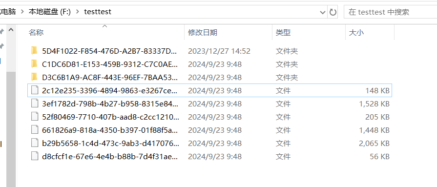

# file-cryptor
文件加解密工具
### 1、背景
对文件或这文件加解密。市面上很多工具都是付费的，做一个免费工具用作加解密。

### 2、项目介绍
基于python3来实现。
这个项目是对个人电脑上的文件或文件夹加解密用的，加密后的文件不可访问（损坏），所以不用担心文件被他人访问。只要密码不泄露，别人即便拿到文件也是一个损坏的文件，无法读取。
注意key文件不要删除，这个是恢复文件的必要数据，删除之后文件将不会再恢复。

文件和文件夹的加密过程有所不同：
- 文件的加密逻辑
  - 从文件头随机读取20-50个字节，并删除。即让文件变成损坏的文件，确保该文件无法被打开。
  - 将删除的这些字节存起来，后期恢复文件时需要用到。
  - 将文件重命名，用一个uuid来重新名文件，确保文件的私密性。
- 文件夹的加密逻辑
  由于是在windows环境下，文件夹不能像文件那样读取字节操作，所以文件夹仅仅做重命名即可，不做文件损坏操作。重命名也是用一个uuid，只不过会把所有字母大写，以跟文件区分开。
最后需要把文件删除的字节以及文件和文件夹重命名前后的关系对应起来，存入一个key文件中，存入的时候会对数据进行aes加密。秘钥是用户自己提供，需要记住自己的密码，否则无法恢复文件。

### 3、适用场景
个人电脑，不适用于多个用户之间传输后解密访问。
目前只实现了基于python程序去加解密，所以电脑上需要有Python运行环境。
后期会考虑做成一个windows安装包，安装后直接使用即可。

### 4、温馨提示
文件加密过程由于涉及到文件损坏（读取部分文件数据并删除），所以key文件不要删除，否则文件将无法再恢复。

